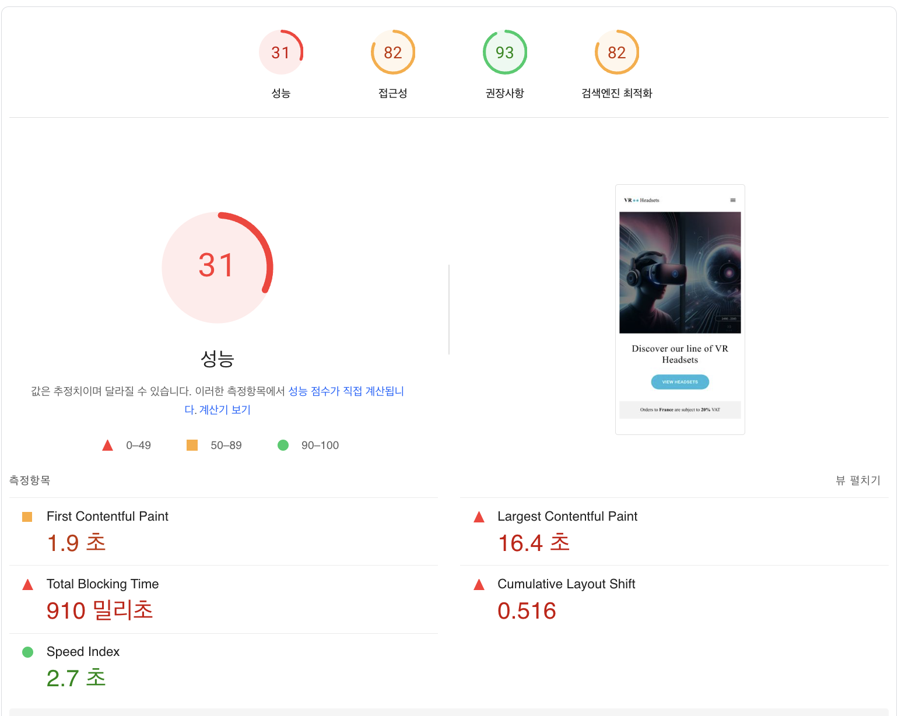
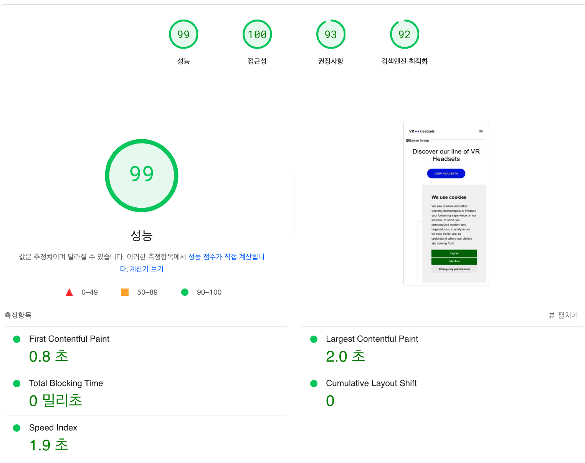
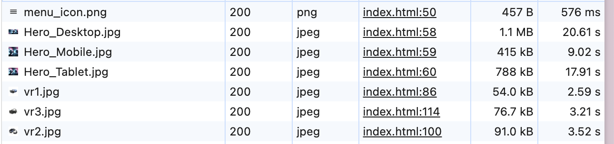
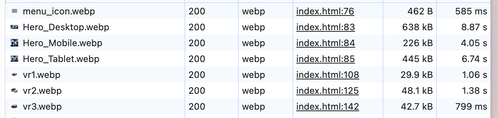
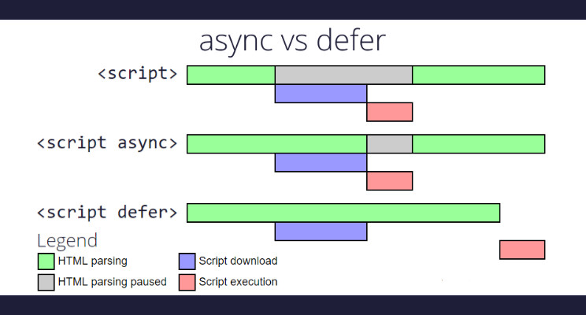
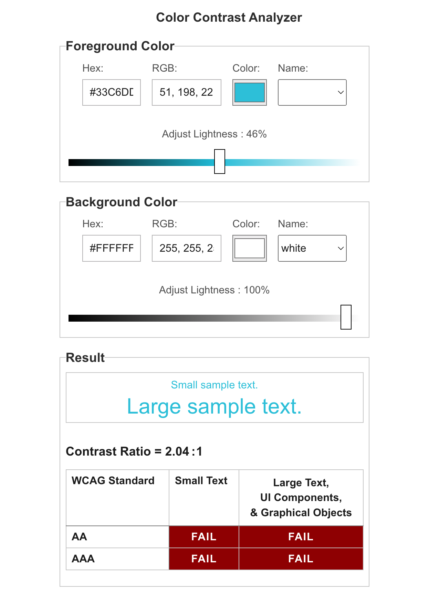
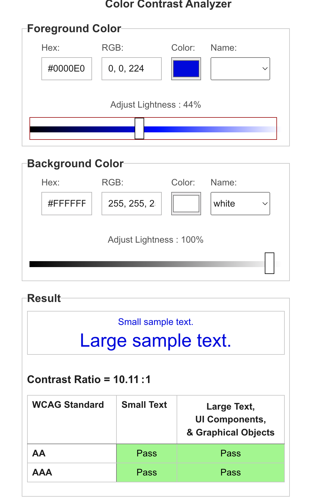

# 성능 측정 개선 사후 보고서

<table>
    <tr>
        <td style="font-size: 20px">AS-IS</td> 
        <td style="font-size: 20px; "><strong>TO-BE</strong></td>
    </tr>
    <tr>
        <td>
            
        </td>
        <td>
            
        </td>
    </tr>
    <tr>
        <td>First Contentful Paint(FCP): 1.9초</td>
        <td><strong>0.8초</strong></td>
    </tr>
    <tr>
        <td>Largest Contentful Paint(LCP): 1.9초</td>
        <td><strong>0.8초</strong></td>
    </tr>
    </tr>
    <tr>
        <td>Total Blocking Time(TBT): 910밀리초</td>
        <td><strong>0초</strong></td>
    </tr>
    </tr>
    <tr>
        <td>Cumulative Layout Shift(CLS): 0.516</td>
        <td><strong>0</strong></td>
    </tr>
        </tr>
    <tr>
        <td>Speed Index: 2.7초</td>
        <td><strong>2.0초</strong></td>
    </tr>
</table>

## 성능

### 1. 차세대 형식 이미지 지원 및 이미지 압축

> WebP 및 AVIF와 같은 이미지 형식은 PNG나 JPEG보다 압축률이 높기 때문에 다운로드가 빠르고 데이터 소비량도 적습니다.

개선 방식:

- jpg 형식의 이미지를 차세대 형식인 webp 형식으로 변경하였음
- 이미지 파일 압축 및 viewport 만큼 이미지 크기 조정

<table>
    <tr>
        <td style="font-size: 16px">AS-IS</td> 
        <td style="font-size: 16px; "><strong>TO-BE</strong></td>
    </tr>
    <tr>
        <td>
            
        </td>
        <td>
            
        </td>
    </tr>
        <tr>
        <td>
            LCP: 16.4초
        </td>
        <td>
            <strong>8.3초</strong>
        </td>
    </tr>
    <tr>
        <td>
            TBT: 910초
        </td>
        <td>
            <strong>600 밀리초</strong>
        </td>
    </tr>
    <tr>
        <td>
            이미지 리소스 1,400KiB 
        </td>
        <td>
            <strong>140 KiB</strong>
        </td>
    </tr>
</table>

<br/>

### 2. 오프스크린 이미지 지연 로드

> 중요한 리소스의 로드가 모두 완료된 후에는 오프스크린 및 숨겨진 이미지를 지연 로드함으로써 상호작용 시작 시간을 줄이는 것이 좋습니다.

개선 방식: source 태그의 media 속성을 선언하여 특정 화면에 맞는 이미지만 불러오도록 변경

```html
<picture>
  <source
    width="576"
    height="576"
    media="(max-width: 575px)"
    srcset="images/Hero_Mobile.webp"
  />
  <source
    width="960"
    height="770"
    media="(min-width: 576px) and (max-width: 960px)"
    srcset="images/Hero_Tablet.webp"
  />
  
</picture>
```

<table>
    <tr>
        <td style="font-size: 16px">AS-IS</td> 
        <td style="font-size: 16px; "><strong>TO-BE</strong></td>
    </tr>
    <tr>
        <td>
            LCP: 8.1초
        </td>
        <td>
            <strong>3.5초</strong>
        </td>
    </tr>
    <tr>
        <td>
            불필요하게 로드되었언 이미지 리소스 크기: 2,270KiB
        </td>
        <td>
            <strong>0 KiB</strong>
        </td>
    </tr>
</table>

<br/>

### 3. 렌더링 차단 리소스 제거

> 리소스가 페이지의 첫 페인트를 차단하고 있습니다. 중요한 JS/CSS를 인라인으로 전달하고 중요하지 않은 모든 JS/Style을 지연하는 것이 좋습니다.

개선 방식:

- GTM, cookie consent script defer 속성 지정
- font script local font로 변경



async와 defer 속성은 스크립트는 다운로드 시 페이지 렌더링을 막지 않는다는 공통점이 있습니다.  
HTML 콘텐츠에 영향을 주지 않는 script라면 상황에 따라 적절히 async, defer를 지정하여 렌더링이 차단되는 점을 개선할 수 있습니다. ([참고자료](https://ko.javascript.info/script-async-defer))

- async: async는 스크립트를 비동기적으로 다운로드하고 즉시 실행
- defer: defer는 스크립트를 비동기적으로 다운로드하지만 HTML 파싱이 완료된 후에 실행

<table>
    <tr>
        <td style="font-size: 16px">AS-IS</td> 
        <td style="font-size: 16px; "><strong>TO-BE</strong></td>
    </tr>
    <tr>
        <td>
            LCP: 8.1초
        </td>
        <td>
            <strong>3.5초</strong>
        </td>
    </tr>
    <tr>
        <td>
            불필요하게 로드되었언 이미지 리소스 크기: 2,270KiB
        </td>
        <td>
            <strong>0 KiB</strong>
        </td>
    </tr>
</table>

<br/>

### 4. 레이지 로딩 적용

기존 코드의 문제점은 뷰포트에 상품 목록화면이 보이지 않아도 API 요청과 이미지 로드를 하고있었습니다.  
사용자 입장에서 상품 목록을 요청하지 않아도 페이지에 접속하면 해당 리소스 만큼 로딩을 기다려야 하는 비효율이 발생합니다.

개선 방식: 특정 요소가 뷰포트 내에 노출된다면 그때 무거운 연산을 수행하도록 Intersection Observer를 사용하였습니다.
추가로 이미지가 로드될 때 레이아웃 시프팅 현상이 발생하지 않도록 스켈레톤 UI를 적용하였습니다.

```js
window.onload = () => {
  let productSection = document.querySelector("#all-products .container");

  const observer = new IntersectionObserver((entries) => {
    if (entries[0].isIntersecting) {
      loadProducts();
      performHeavyCalculation();
      observer.unobserve(productSection);
    }
  });
};
```

<table>
    <tr>
        <td style="font-size: 16px">AS-IS</td> 
        <td style="font-size: 16px; "><strong>TO-BE</strong></td>
    </tr>
    <tr>
        <td>
            
        </td>
        <td>
            
        </td>
    </tr>
    <tr>
        <td>
            TBT: 1,670 밀리초
        </td>
        <td>
            <strong>0 밀리초</strong>
        </td>
    </tr>
    <tr>
        <td>자바스크립트 기본 스레드 작업: 2.4초</td>
        <td><strong>0.3초</strong></td>
    </tr>
    
</table>

<br/>

## 접근성 & 검색엔진 최적화

### 1. 제목 요소를 내림차순으로 표시

> 문서에서 heading 태그는 내림차순으로 표시되어야 하며 또한 건너뛰는 단계 없이 순차적으로 나타내야 합니다. ([참고자료](https://developer.mozilla.org/ko/docs/Web/HTML/Element/Heading_Elements))

개선 방식: 각 정보에 맞는 마크업을 내림차순으로 표시

<table>
    <tr>
        <td style="font-size: 16px">AS-IS</td> 
        <td style="font-size: 16px; "><strong>TO-BE</strong></td>
    </tr>
    <tr>
        <td>
            <h5>h5</h5>
            <h4>h4</h4>
            <h3>h3</h3>
        </td>
        <td>
            <p>p</p>
            <h2>h2</h2>
            <p>p</p>
        </td>
    </tr>
    <tr>
        <td>검색엔진 최적화 점수: 82점</td>
        <td><strong>94점</strong></td>
    </tr>
</table>

<br/>

### 2. 이미지 alt 속성 지정

> alt 속성은 사용자가 느린 네트워크 환경이나 src 속성값의 오류, 시각 장애인용 스크린 리더의 사용 등 어떤 이유로든 사용자가 이미지를 볼 수 없을 때 이미지 대신 제공할 대체 정보를 제공합니다. 이미지 정보를 제공하는 역할로 alt 속성은 접근성과 검색엔진을 위해 지정해야 합니다. ([참고자료](https://accessibility.naver.com/acc/guide_01))

개선 방식: img 태그를 사용할 때 alt 속성을 필수적으로 선언

<table>
    <tr>
        <td style="font-size: 16px">AS-IS</td> 
        <td style="font-size: 16px; "><strong>TO-BE</strong></td>
    </tr>
    <tr>
        <td>접근성 점수: 82점</td>
        <td><strong>92점</strong></td>
    </tr>
    <tr>
        <td>검색엔진 최적화 점수: 82점</td>
        <td><strong>94점</strong></td>
    </tr>
</table>

<br/>

### 3. 메타 설명 추가

> `<meta name="description">` 요소는 검색엔진이 검색결과에 포함하는 페이지 콘텐츠의 요약을 제공합니다. 고품질의 고유한 메타 설명을 사용하면 페이지의 관련성을 높이고 검색 트래픽을 늘릴 수 있습니다. ([참고자료](https://developer.chrome.com/docs/lighthouse/seo/meta-description?utm_source=lighthouse&utm_medium=lr&hl=ko))

개선 방식: 서비스를 설명을 서술적으로 meta 정보에 추가

```html
<meta
  name="description"
  content="Discover top-quality VR headsets from leading brands. 
    Shop our best-selling virtual reality devices for immersive gaming and entertainment experiences."
/>
```

<table>
    <tr>
        <td style="font-size: 16px">AS-IS</td> 
        <td style="font-size: 16px; "><strong>TO-BE</strong></td>
    </tr>
    <tr>
        <td>검색엔진 최적화 점수: 92점</td>
        <td><strong>100점</strong></td>
    </tr>
</table>

<br/>

### 4. 백그라운드 및 포그라운드 색상의 대비율 조정

> 글자색과 배경색의 대비가 떨어져 가독성에 문제가 생길 수 있다.

개선 방식: [색상 대비 분석기 사이트](https://dequeuniversity.com/rules/axe/4.9/color-contrast)에서 백그라운드에 맞는 대비 색상을 찾아 수정

<table>
    <tr>
        <td style="font-size: 16px">AS-IS</td> 
        <td style="font-size: 16px; "><strong>TO-BE</strong></td>
    </tr>
    <tr>
        <td>
            
        </td>
        <td>
            
        </td>
    </tr>
    <tr>
        <td>접근성 점수: 92점</td>
        <td><strong>100점</strong></td>
    </tr>
</table>

## 리뷰 받고 싶은 부분
